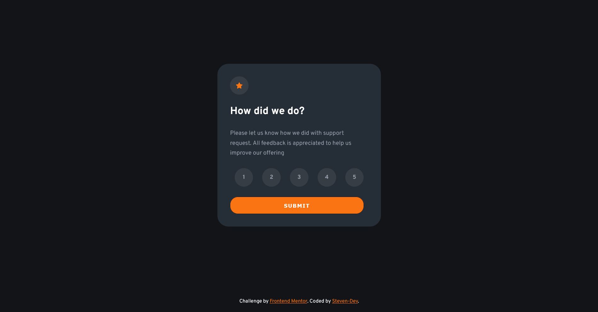

# Frontend Mentor - Interactive-rating-component

This is a solution to the [Interactive-rating-component](https://www.frontendmentor.io/challenges/interactive-rating-component-koxpeBUmI). Frontend Mentor challenges help you improve your coding skills by building realistic projects.

## Table of contents

- [Overview](#overview)
  - [The challenge](#the-challenge)
  - [Screenshot](#screenshot)
  - [Links](#links)
- [My process](#my-process)
  - [Built with](#built-with)
  - [What I learned](#what-i-learned)
  - [Continued development](#continued-development)
- [Author](#author)

## Overview

### The challenge

Your users should be able to:

- Select and submit a number rating
- See the "Thank you" card state after submitting a rating
- View the optimal layout for the app depending on their device's screen size
- See hover states for all interactive elements on the page

### Screenshot

### Links

- Solution URL: [Click here](https://stv-devl.github.io/Interactive-rating-component/)

## My process

CSS with SASS, I used grid and flexbox. Vanilla Javascript.

- When we choose a rating and submit it, the" thank you card" will be display with our rating number. - When we select a rating button, it turns gray. If we choose another button, the gray will be removed on the other button.
- When we click on the thank you card again, we return to the rating card.

### Built with

- Semantic HTML5 markup
- CSS custom properties
- Flexbox
- CSS Grid
- Mobile-first workflow
- SASS / SCSS
- JAVASCRIPT

### What I learned

Interesting challenge for practice javascript.

### Continued development

Junior javascript exercices

## Author

- Website - [Steven](https://github.com/Stv-devl)
- Frontend Mentor - [@y/Stv-devl](https://www.frontendmentor.io/profile/Stv-devl)
